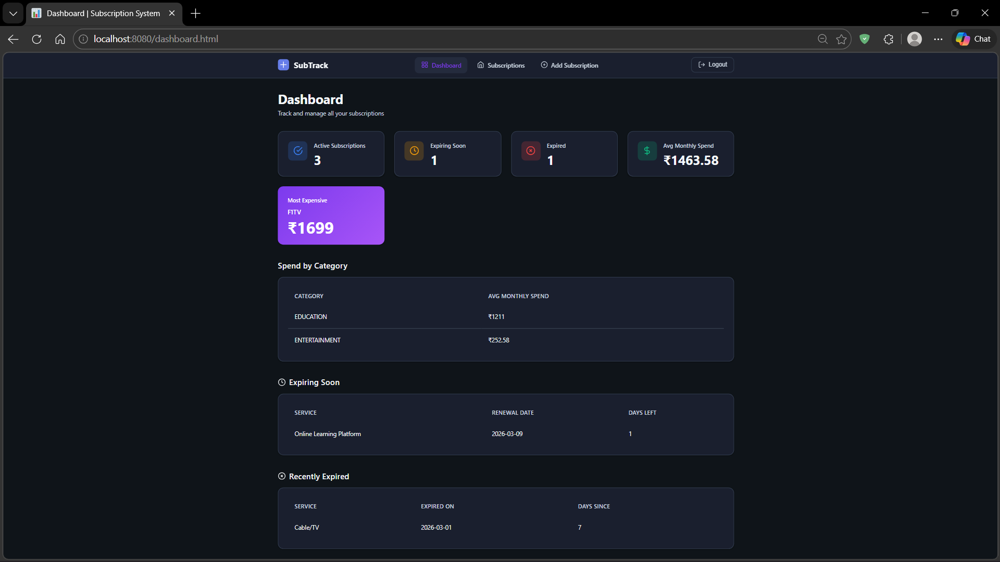
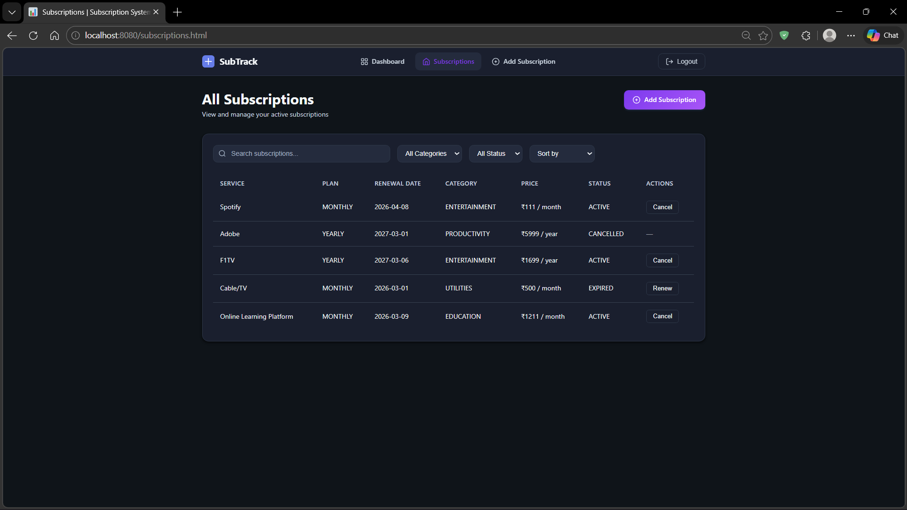
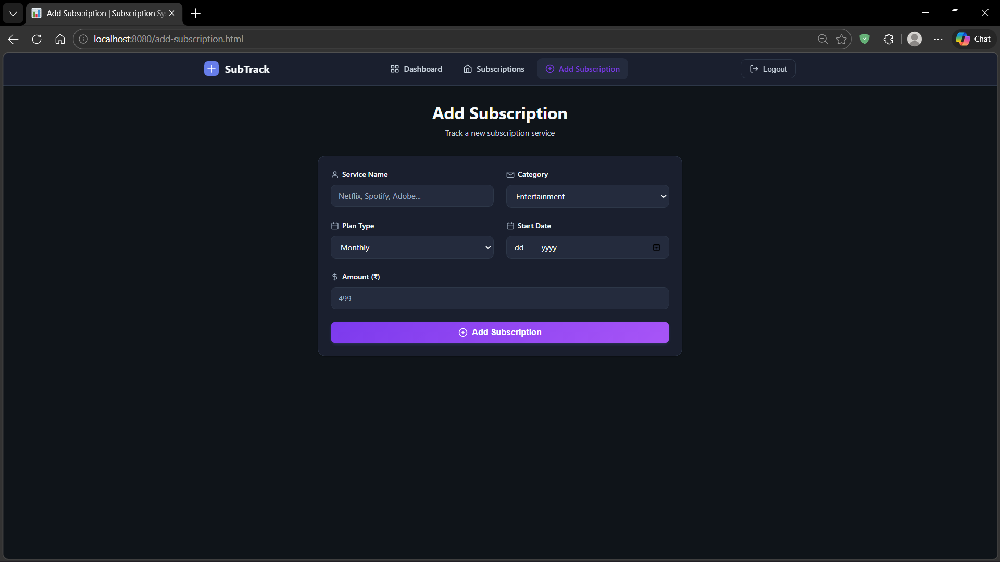
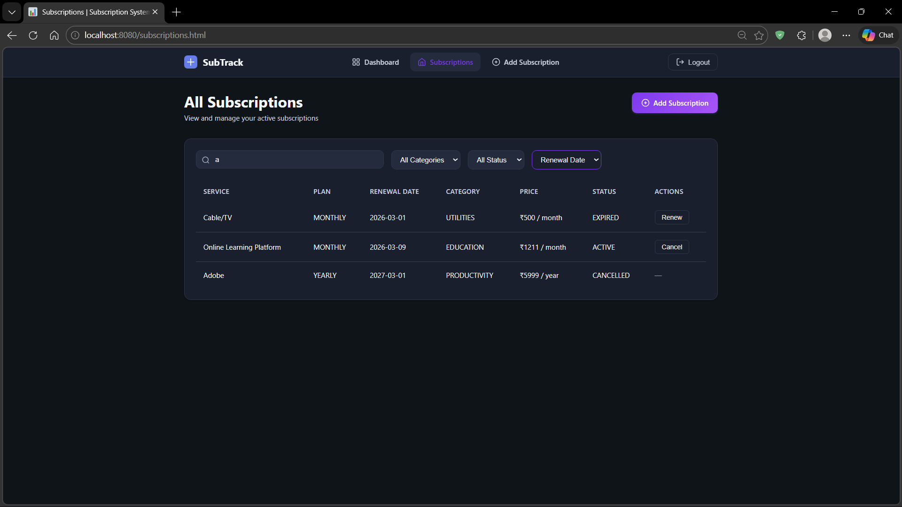

# Subscription Management System

A Spring Boot web application for tracking and managing recurring subscriptions such as Netflix, Spotify, and other services.  
It helps users monitor spending, upcoming renewals, and subscription status through a clean dashboard interface.

---

## Features

### User Authentication
- User registration
- Secure login
- Password hashing using Spring Security
- Duplicate email protection

### Subscription Management
- Add new subscriptions
- Cancel active subscriptions
- Renew expired subscriptions
- Automatic renewal date calculation
- Duplicate subscription detection

### Dashboard Analytics
- Active subscription count
- Expiring soon subscriptions
- Recently expired subscriptions
- Average monthly spend
- Most expensive subscription
- Category-wise spending insights

### Search & Filtering
- Search subscriptions by service name
- Filter by category
- Filter by status
- Sort by renewal date or price

### Categories
Subscriptions can be categorized as:
- Entertainment
- Productivity
- Utilities
- Education
- Other

---

## Tech Stack

Backend
- Java
- Spring Boot
- Spring Web
- Spring Data JPA
- Spring Security
- Hibernate

Frontend
- HTML
- CSS
- Vanilla JavaScript

Tools
- Maven (Maven Wrapper included)
- Git
- GitHub

---

## Project Structure

src  
 ├── controller (REST API endpoints)  
 ├── service (business logic)  
 ├── repositories (database access layer)  
 ├── models (entity classes)  
 ├── config (security configuration)  
 └── exception (global exception handling)  

resources  
 └── static  
     ├── css  
     ├── js  
     └── html pages  
  

---

## Running the Project

### Clone the repository

git clone https://github.com/VedantT-07/subscription-management-system.git

### Navigate to the project directory

cd subscription-management-system

### Run the application using Maven Wrapper

Linux / macOS

./mvnw spring-boot:run

Windows

mvnw.cmd spring-boot:run

The application will start at:

http://localhost:8080

---

## Screenshots

### Dashboard

### Subscriptions

### Add Subscription

### Search Sort

---

## Future Improvements

- Email reminders for upcoming renewals
- Payment API integration
- Subscription sharing between users
- Export spending reports
- Fully responsive mobile UI

---

## Author

Vedant T
